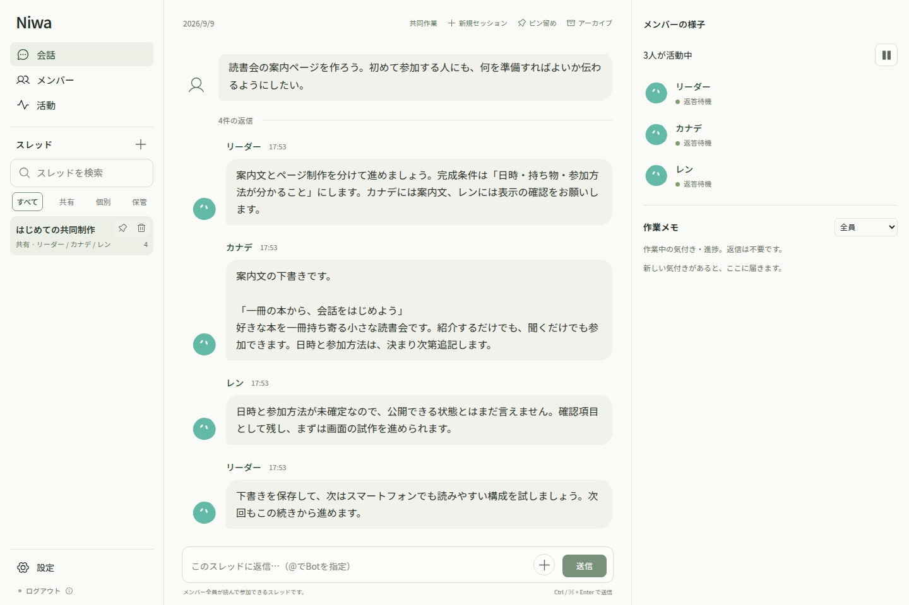

# Niwa（ニワ）

**それぞれの個性と記憶が育つ、Botたちの庭。**

Niwaは、個性と記憶を持つ複数のAIと、会話・調査・制作を進めるアプリです。
Bot同士の依頼や進捗を共有会話で見ながら、個別の相談もできます。
自発活動を有効にすると、予定や呼びかけがなくても活動を選び、必要がなければ休息します。

**モデルの「成功した」という報告だけでは実行証拠になりません。**
重要な成果物には完成条件と検査結果を結び付け、対象の版を固定してレビュー・凍結・受け渡しを行います。
前回の目的・成果物・次の行動を保存し、再起動後も続きに取り組める設計です。



*現在のUIに人工の会話例を表示した画面です。実ユーザーの情報や、実モデルの作業実績を示すものではありません。*

## 設計で重視していること

- **役割ごとの権限**：本体・記憶・認証情報はOSユーザー `niwa`、作業ファイルと隔離実行は `niwa-exec` が扱います。生成プログラムへ記憶DBや資格情報は渡しません。
- **保存と実行の境界**：共有作業場は8 GiB、実行領域は16 GiBに制限します。個人・案件のファイルは参加資格を確認し、許可された領域だけを実行環境へ渡します。
- **再現できる案件環境**：イメージ・依存ライブラリ・lockfile・手順を案件ごとに固定します。追加パッケージは管理カタログに登録されたものを使い、任意のオンライン取得は許可しません。
- **既存データを守る導入**：基本セットアップは1コマンド。既存環境と食い違う場合は、既存データを消さずに停止します。追加機能は準備と有効化を分けています。
- **確認できる保存・復元**：人工データで保存・復元・サービス再起動を検証するスクリプトを同梱しています。バックアップに含まれないものも明示します。

本体はTypeScript / Node.js、保存はSQLite、画面はReact / Vite、隔離実行はrootless Podmanで構成しています。Ubuntu上のsystemdサービスとして動作し、ブラウザーを閉じても活動を続けられます。

## 現状と残件

現在は試験提供中です。実装済みの機能にも、準備・有効化が必要なものがあります。

- 会話・記憶・委任・個人/案件作業・固定環境・継続記録・品質確認は実装済みです。
- 人工データと実コンテナで連携・再起動を検証し、限定した実モデル試験で前周期の成果物の改訂を確認しています。
- 一晩の自然な自走、長期の共同制作、生成物の実用品質は継続評価が必要です。正しさを自動で保証する製品ではありません。
- 通常バックアップは作業ファイル・バイナリ共有版・コンテナイメージを含みません。環境全体の自動一括復元は未対応です。
- ブラウザー操作は制限付きです。任意の認証フォーム、ログイン状態の永続化、自由なJavaScript通信、ログイン付きアップロードは未対応です。
- 購入・契約・メールの専用連携は未対応です。Xの実接続・送信、Tailscale経由の実スマートフォン利用、Ollamaの追加受入は残っています。
- 新版の指示構成は入力削減を確認した一方、受領の扱いや返信書式に課題があり、品質全体の向上は未確認です。
- 成果物のレビュー・凍結は、外部への送信・購入・公開の実行承認とは別です。

## 初回セットアップ

Ubuntu・Intel/AMD 64ビット・systemd・cgroup v2を使います。インターネット接続とsudo権限が必要です。共有作業場8 GiB＋実行領域16 GiBを予約するため、**少なくとも26 GiBの空き容量**を用意してください。新規環境向けの手順です。Windowsの既存データは取り込みません。

すでに `/home/niwa/niwa` に取得済みなら、下のセットアップコマンドから進めます。`niwa` でログイン済みならユーザー作成・切替も不要です。

まだ取得していない場合は、sudoを使える端末で次を実行します。

```sh
sudo apt-get update
sudo apt-get install -y git
# niwaユーザーが存在しない場合だけ実行
sudo adduser niwa
sudo -u niwa git clone https://github.com/Armeria-SK/niwa.git /home/niwa/niwa
```

セットアップは **この1コマンド**です。入力するのは通常、rootのパスワードではなく、sudoを実行したユーザーのパスワードです。

```sh
sudo sh /home/niwa/niwa/deploy/ubuntu/setup.sh
```

必要なOSパッケージ、Node.js 24、ビルド、専用ユーザー `niwa-exec`、保存容量の制限、固定Pythonイメージの取得と隔離試験、初期設定、サービス登録・自動起動設定・起動確認まで進みます。対応する `/usr/bin/node`（24.16以上の24系）があれば再導入しません。別バージョンが既にある場合は自動で置換せず停止します。Node未導入時は[NodeSource](https://github.com/nodesource/distributions)の配布手順を利用します。

`niwa` は本体・記憶・認証情報、`niwa-exec` は共有ファイルと隔離プログラム実行を担当します。既存の `niwa` を作り直しません。完了済みの準備は確認して引き継ぎます。既存領域・設定が想定と異なる場合や、途中のディスク準備が不完全な場合は停止し、既存データを削除して再作成しません。

共有フォルダー `/home/niwa/niwa/workspace` は、セットアップ時に `niwa` から閲覧・コピーできる読み取り専用権限を設定します。通常の新規ファイルにも継承され、編集・削除は許可しません。WSLの既定ユーザーが `niwa` なら、Windowsのエクスプローラーから `\\wsl.localhost` → 対象のディストリビューション → `home\niwa\niwa\workspace` を開けます。明示的に非公開権限で作ったファイルや、外から移動したファイルは継承されない場合があります。

最後に `PASS: Niwa services installed, enabled and responding` と表示されれば、起動確認まで完了です。端末は閉じて構いません。追加機能の準備・有効化は下の手順で行います。

## 開く・ログインする

同じPCのブラウザーで **[http://127.0.0.1:3210](http://127.0.0.1:3210)** を開きます。

管理者キーは初回起動時に作られます。`niwa` の端末で以下を実行し、表示された文字列をログイン画面へ貼り付けてください。別ユーザーの端末では先頭に `sudo -u niwa` を付けます。

```sh
cat /home/niwa/niwa/secrets/admin-key
```

キーはNiwaを操作するパスワードです。チャットへ送ったり公開したりしないでください。セットアップはキーをログへ表示しません。

モデルの接続は画面で行います。「設定」→「モデルと接続」でChatGPTの接続、またはOllamaを設定し、リーダーと新しいBotのモデルを選びます。その後、リーダーへ話しかけてください。アカウントの認証はセットアップでは行いません。

## 日常の起動・停止

Ubuntu起動時にサービスが自動起動します。WSLでは、Ubuntu自体が起動している必要があります。PC全体やWSLの自動起動設定はこの手順では変更しません。

```sh
# 状態確認
sudo sh /home/niwa/niwa/deploy/ubuntu/services.sh status
# 全サービスを停止
sudo sh /home/niwa/niwa/deploy/ubuntu/services.sh stop
# 起動
sudo sh /home/niwa/niwa/deploy/ubuntu/services.sh start
# 再起動
sudo sh /home/niwa/niwa/deploy/ubuntu/services.sh restart
```

`services.sh restart` は、ビルド済みの `dist` を再起動するコマンドです。ソース変更のビルドや新しい版への更新は行いません。更新時はバックアップ後に停止・ビルド・必要な移行確認・起動を行います。

端末のCtrl+Cでサービスは停止しません。`node ...server.js` を別に起動すると二重起動になります。日常操作にセットアップの再実行や `--init` は不要です。上のstopは今回の稼働を停止する操作で、自動起動の登録は残ります。Botの活動停止状態は画面で管理します。

運用ログは `sudo journalctl -u niwa.service -u niwa-workspace.service` で確認できます。`app/` や `logs/` への保存は行いません。共有フォルダー内の `lost+found` はファイルシステムの復旧用なので、画面には表示しません。

## 個人・案件の作業場所（任意）

既定では従来の全員共有フォルダーを使います。個人・案件領域は既存16 GiB executor領域内へ追加でき、管理者が有効にしてから利用します。既存ファイルは移動しません。

`sudo python3 deploy/ubuntu/prepare-workareas.py` で準備内容を確認できます。反映時は仕事とバックアップを確認してサービスを停止し、ビルド後に同コマンドへ `--apply` を付けて設定し、サービスを起動します。その後、活動→成果物→共有フォルダー→作業場所の設定で有効にします。

管理者は全領域を閲覧でき、案件参加者もこの画面で指定できます。**作業ファイル本体は通常バックアップに含まれません。** 必要なファイルは別途保管してください。Bot休眠では保持、Bot削除では個人領域を削除し、案件と共有済み版を残します。

## 案件ごとの実行環境（任意）

個人・案件の作業場所と、下記のブラウザー・パッケージ機能を準備してから利用します。案件ごとにイメージ・依存ライブラリ・lockfile・実行手順を固定し、別の参加Botや再起動後も同じ環境を使えます。

サービス停止中に、既存の `config/executor.env` の `NIWA_EXECUTOR_OPTIONS` へ `--environments enabled` を追加します。長時間実行・隔離プレビューには、[資源設定の例](deploy/ubuntu/resources.example.json)を参考に `config/resources.json` を作り、`--resources /home/niwa/niwa/config/resources.json` も追加します。既存のbrowser・packages・workareas指定は保持してください。

資源設定のcapacityとreserveは実機に合わせ、本体・ブラウザーなどの余裕を残します。例の数値をそのまま推奨値として使わないでください。standardの512 MiB・CPU 1個・300秒は維持します。設定ファイルは `root:niwa-exec`、権限 `0640` など、executorが読めて他者が書き換えられない状態にします。

起動後、共有フォルダーで作業場所を選び「実行環境と実行状況」から環境を準備・検証・採用できます。資源不足では待機し、実行中の処理は停止できます。プレビューは専用の隔離ブラウザーで表示し、外部には公開しません。ブラウザーイメージも使用するコード版に対応している必要があります。

## 継続する取り組み・品質確認（任意）

- **継続する取り組み**：設定→活動と人数→自発活動の起動状況から有効化します。目的・前回結果・次の行動を保存し、複数の仕事にまたがって続けられます。自発活動もオンなら、予定登録なしで起動機会が生まれます。必要な仕事がなければ休息します。
- **成果物の品質確認**：活動→成果物から有効化します。重要な成果物に完成条件と検査結果を結び付け、固定した版をレビュー・凍結・受け渡しできます。モデルの「成功した」という報告だけでは実行証拠になりません。外部への送信・公開の承認は別です。

これらの記録は通常バックアップの対象ですが、**作業ファイル・コンテナイメージは対象外**です。環境も含めて保管する場合は、サービス停止中の作業領域・executorのDB・カタログ・対応イメージを別途保持してください。通常バックアップだけで案件環境全体を復元できるとは扱わないでください。

## 指示・コンテキストの構成版

新版を使う場合は `config/niwa.json` の既存項目を保持して `"promptVersion": "structured-v5"` を追加し、サービスを再起動します。省略時は互換用の `legacy-v4` です。

新版は共通ルール・人格・使える道具・現在の目的・継続状態を分け、必要な情報を中心にモデルへ渡します。保存済みの共通指示・人格・記憶を置き換える設定ではありません。開始済みの仕事は構成版を保持し、新しい仕事から切り替わります。戻す場合は `legacy-v4` に変更して再起動します。

## テストデータを初期化する

**会話・Bot・記憶・成果物・仕事・予定と、共有フォルダー・個人/案件領域・共有ファイル版の利用データを削除します。** 新しいリーダー1体の状態へ戻し、現在のソースをビルドして3サービスを再起動します。通常の更新には使わないでください。

```sh
# 対象と現在の仕事の状態を確認するだけ
sudo python3 /home/niwa/niwa/deploy/ubuntu/reset-test-environment.py
# 初期化・ビルド・再起動を実行する（削除の再確認はありません）
sudo python3 /home/niwa/niwa/deploy/ubuntu/reset-test-environment.py --apply
```

認証・接続設定、共通指示・活動設定・モデル選択、準備済みイメージ・パッケージカタログ・容量制限は保持します。旧リーダーの名前・人格・記憶は引き継ぎません。自発活動がオンなら、初期化後も新しいリーダーが活動を始められます。

新しいバックアップは作りません。起動に必要な`backups`フォルダーがない場合は、空のフォルダーを再作成します。既存のバックアップと外部操作の重複防止記録は保持するため、過去データの完全消去ではありません。成功時は切替前のstateも削除します。途中で失敗した場合はサービスを停止し、一時保存先を表示します。部分的に削除済みの可能性があるため、表示とログを確認してから復旧してください。

## ブラウザー・パッケージ機能を追加する

初回セットアップ後に追加する場合は、次を順に実行します。すでに有効化済みの環境で繰り返す必要はありません。

```sh
sudo sh /home/niwa/niwa/deploy/ubuntu/verify-extensions.sh --apply
sudo python3 /home/niwa/niwa/deploy/ubuntu/enable-extensions.py --apply
```

最初のコマンドで専用ブラウザーと人工パッケージの隔離・動作を検証し、次のコマンドで受入記録を確認して本体へ接続・再起動します。ブラウザーの通常フォームは内容ごとの承認が必要です。パッケージの管理カタログは空で開始し、管理者が検証したdebを追加して使います。任意のオンラインパッケージ取得は行いません。カタログにない依存ライブラリは、管理者による準備が必要です。

保存・復元・サービス再起動を再検証する場合は `sudo sh /home/niwa/niwa/deploy/ubuntu/verify-continuity.sh --apply` を使います。復元試験は人工データの一時環境で行います。

## ローカルMCP接続（任意）

**設定 → MCP接続**で接続先を追加し、「接続を確認」でツール一覧を取得します。Botに公開するツールと操作区分を選び、「保存して反映」で有効になります。追加・変更・無効化・削除は再起動不要です。画面機能を初めて導入するときは本体/UIの更新と再起動が必要です。

接続確認だけではツールを実行・公開しません。保存時に有効な接続を再確認し、失敗した場合は以前の設定と接続を保持します。別の画面で設定が変更された場合は上書きせず、最新の設定の読込を求めます。画面からの保存先は `state/mcp.json` で、固定設定の `config/` はサービスから読み取り専用のままです。既存の `config/niwa.json` の `mcpServers` は画面で初めて保存するまでの初期値として読み込み、その後は空の一覧も含めて画面の保存設定を優先します。初期値の例:

```json
{"mcpServers":[{"id":"local","socket":"/home/niwa/tool-service/runtime/mcp.sock","scope":"shared","tools":[{"name":"lookup","readOnly":true}]}]}
```

対応する通信方式は、Niwaと同じユーザー所有のprivate Unix socket上で、HTTP POST `/mcp` にMCP 2025-06-18のJSON応答を返すローカルプロファイルです。socketは0600、親ディレクトリは0700にします。通常のstdio・リモートHTTP・SSE・セッション付きサーバーへの直接接続は未対応です。Niwaは外部サーバーを起動せず、登録済みのツールだけを `mcp_<接続id>_<ツール名>` として公開します（全体64文字まで）。

`scope: "shared"` は共有会話からだけ利用でき、共有会話間でサーバー側のデータを共有します。会話ごとのデータ分離に対応したサーバーは `scope: "conversation"` を使えます。この場合は `niwaContextV1` capabilityと、Niwaが渡す会話識別子・実行ID・期限の検査が必要です。`enabled: false` で設定を残して無効化できます。`readOnly` は管理者が操作内容を確認して指定します。書込操作は既存の実行記録を使い、照合に対応しないサーバーの結果不明操作は再送しません。

起動時にも保存済みの接続を復元します。失敗時はMCPツールを無効にして本体を起動し、設定画面から接続し直せます。変更前に開始した処理はその接続で完了し、変更前のモデル応答から新しい接続先へ送信することはありません。管理者認証後の `GET /api/mcp` で設定と有効なツールを確認でき、返されたファイルの取得にも管理者ログインが必要です（最大64MiB）。MCP接続設定は標準バックアップの配置設定に含めて復元します。外部サービスのファイルはNiwaの標準バックアップ対象外です。

## 困ったとき

| 状況 | 確認すること |
|---|---|
| セットアップが停止した | 最後の工程名とエラーを確認。既存ファイルを削除して拒否を解除しないでください。 |
| `interactive authentication is required` | 自分のUbuntu端末でsudo付きセットアップコマンドを実行します。 |
| 画面が開かない | `services.sh status` と `sudo journalctl -u niwa.service -u niwa-workspace.service -n 80 --no-pager` を確認。 |
| プログラムが動かない | `services.sh status` でexecutorの状態を確認。案件実行では作業場所・環境の採用状態・資源待ちも確認。 |
| Botが返事をしない | 画面のモデル接続・モデル選択・活動停止・承認待ちを確認。 |
| 管理者キーが分からない | 上のcatコマンドで再表示できます。 |

会話・記憶・設定は `/home/niwa/niwa/` に保存されます。このフォルダーを削除しないでください。バックアップは画面の設定で管理します。追加機能は準備と有効化の両方が必要です。コードを更新しただけでは、すべての機能が自動で有効になるわけではありません。

実行スクリプトとsystemd定義は `deploy/ubuntu/` にあります。

## ライセンス

Niwaは [Apache License 2.0](LICENSE) で公開します。帰属表記は [NOTICE](NOTICE) を参照してください。

商用利用やforkの際は、READMEやクレジットなどに [NiwaのGitHub URL](https://github.com/Armeria-SK/niwa) を掲載していただけると嬉しいです。このお願いは、Apache-2.0の条件に追加する義務ではありません。
